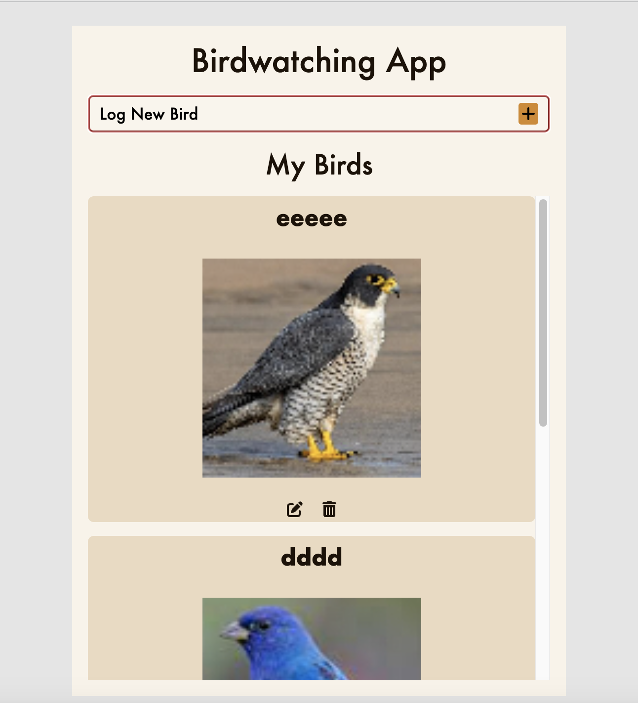
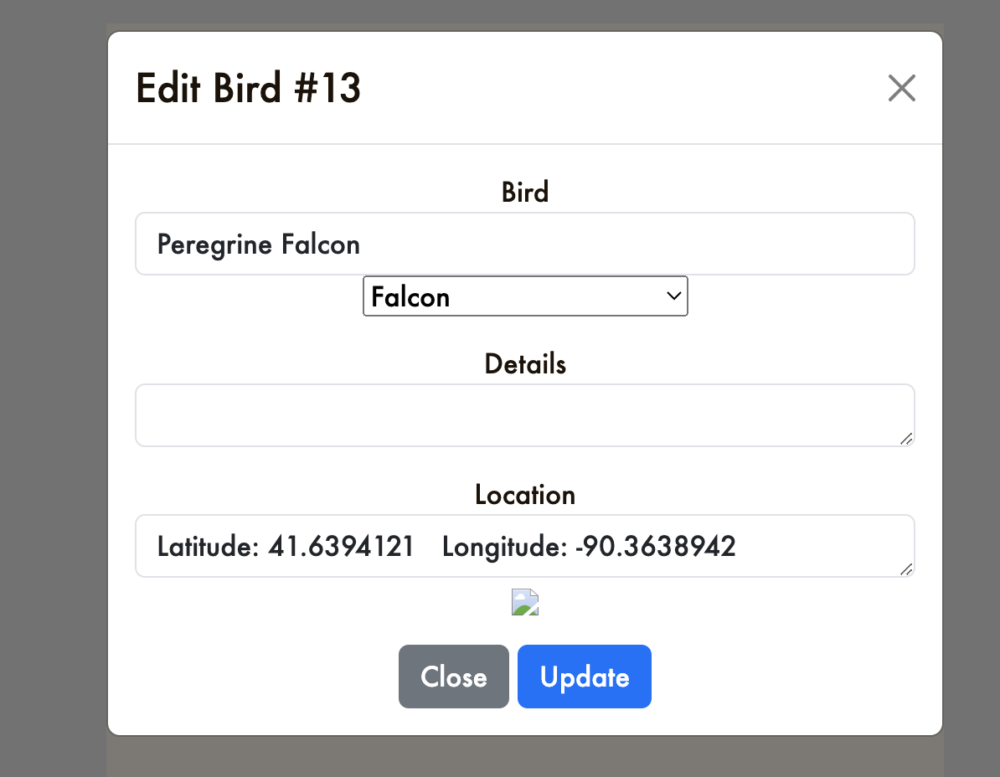
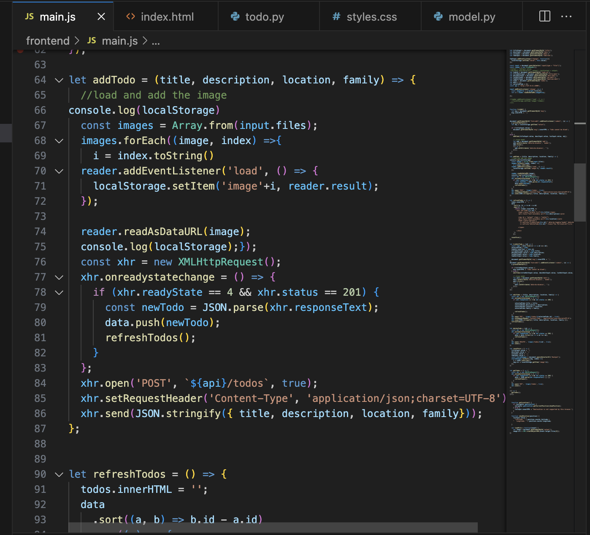

# Birdwatching-Project
Midterm

This project allows users to upload interesting birds that they find, including an image, location, description, and family type.

Each bird can be edited and updated, or deleted after creation.

The code works by gathering the details of each entry, and sending it through an XML request to the server. Images are processed outside these functions for storage purposes.

